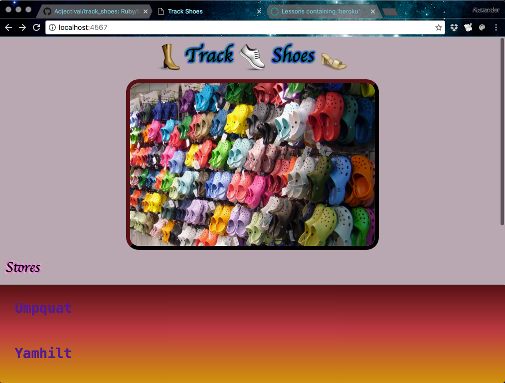

# Track Shoes :shoe::boot::sandal:
## _A Ruby/Active Record Many-to-Many project_
### By _Alexander Jacks_
_an Epicodus Project, July 2016_

### Description
Track Shoes is a web app that can manage inventories of products (shoes) in distribution centers (stores). This business scenario requires a many-to-many database schema.



## Setup
- Clone/download this project directory
- Open terminal in project directory
```
$ postgres
$ bundle
$ rake db:create
$ rake db:schema:load
$ ruby app.rb
```

- Open browser and visit: [**_localhost:4567_**](http://localhost:4567/)

## User Stories
- As a user, I want to be able to **add, update, delete and list shoe stores**.
 - As a user, I want to be able to **add shoe brands in the application**.
 - As a user, I want to be able to **add shoe brands to a store** to show where they are sold.
- As a user, I want to be able to **see all of the brands** a store sells **on the individual store page**.

- As a user, I want store names and shoe brands to be **saved with a capital letter** no matter how I enter them.
- As a user, I **do not want blank names for stores and shoes to be saved**.

## Technologies Used
- Application: Ruby, Sinatra, Active Record
- Testing: Rspec, Capybara
- Database: Postgres
- Design: Bootstrap 3

### Support and contact details
_Contact alexd (dot) jacks (at) gmail (dot) com with questions regarding this software.
Check out some of these resources to understand the technologies:_
- _learnhowtoprogram.com_
- _ruby-lang.org_
- _w3schools.com_

### Legal
ISC License

Copyright (c) [2016], [Alexander Jacks]

Permission to use, copy, modify, and/or distribute this software for any purpose with or without fee is hereby granted, provided that the above copyright notice and this permission notice appear in all copies.

THE SOFTWARE IS PROVIDED "AS IS" AND THE AUTHOR DISCLAIMS ALL WARRANTIES WITH REGARD TO THIS SOFTWARE INCLUDING ALL IMPLIED WARRANTIES OF MERCHANTABILITY AND FITNESS. IN NO EVENT SHALL THE AUTHOR BE LIABLE FOR ANY SPECIAL, DIRECT, INDIRECT, OR CONSEQUENTIAL DAMAGES OR ANY DAMAGES WHATSOEVER RESULTING FROM LOSS OF USE, DATA OR PROFITS, WHETHER IN AN ACTION OF CONTRACT, NEGLIGENCE OR OTHER TORTIOUS ACTION, ARISING OUT OF OR IN CONNECTION WITH THE USE OR PERFORMANCE OF THIS SOFTWARE.

*2016 AJ*
